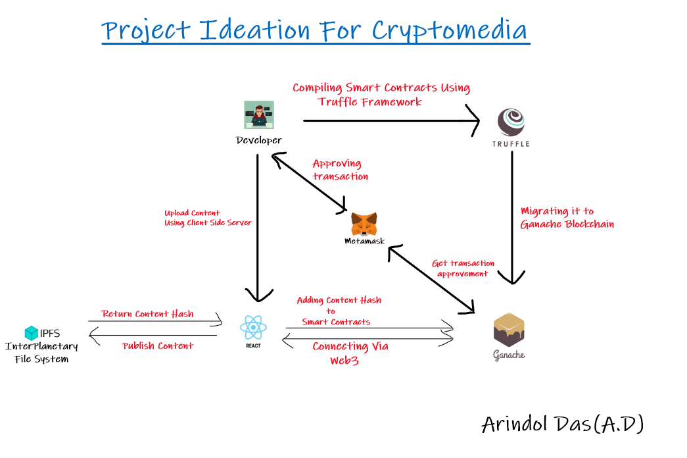

# Cryptomedia: A decentralized social media app build on Ethereum

## App Description:

A social media app through which one can upload contents and can get tipped by cryptocurrency(Ethereum) for their contents by other users.

### Front-End Stack:

The client-side server is developed using React

### Compiling Smart Contracts:

Truffle Suite Framework: It compiles the smart contracts

### Mining and Testing

Ganache: It is a personal Ethereum Blockchain which is used to run tests, execute commands and inspect state while controlling how the chain operates.

### Crypto Wallet:

Metamask: It is the cryptocurrency wallet that allow the transactions of the Ethereum cryptocurrency, interacting directly with the blockchain (in case of my project it is the Ganache blockchain).   

## IPFS (InterPlanetary File System):

The decentralized way of storing data with a peer-to-peer network of user-operators.

Data are stored using contract based IPFS. Here, instead of storing all data on-chain, the hash where the data is located on a chain is stored.
